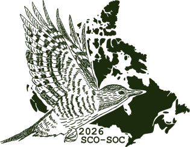

{width=50% fig-align="center" fig-alt=""}

**October 5-7, 2026**

We're thrilled to announce that our 2026 Conference will take place online—opening the doors to a broad, diverse community of participants from across the globe! This year's theme, **Spreading Our Wings**, celebrates accessibility, connection, and the joy of shared discovery within our research community. We can't wait to engage with our members and explore new ways to learn and collaborate together.

Save the dates! Details on submitting workshops, symposiums, and abstracts will be shared soon.

{fig-align="center" style="max-width:100px;" fig-alt=""}

::: {.column-screen}
{fig-alt=""}
:::