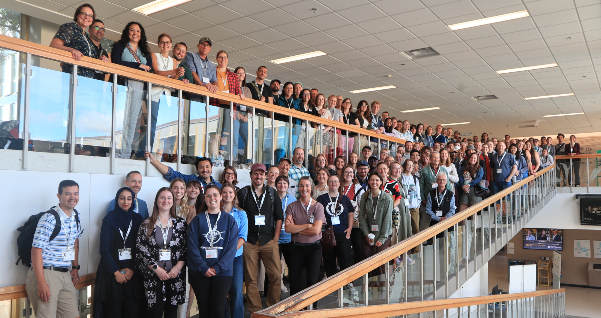

### Participate {.hide}

> **Open Calls**  
> 
> - [Abstracts](#presentations) (due **July 15th 2026**) 

{width=75% fig-alt="" .center}

### Registration

This year's conference is free to members! 

Not a member? [Become a member!](https://www.zeffy.com/en-CA/ticketing/1d8439b2-5cea-4886-a00a-3fa734fa8610)

At the time of registration you are encouraged to make a donation to the society, which will directly support student travel to our 2027 joint conference in Viña del Mar, Chile! 

**The registration and donation portal will open in August! Stay tuned.**

---

### Workshops {#workshops}

**Deadline**: Closed (~~May 31st 2026~~)  
**Workshop Date**: Closed  
**Length**: 2 hour, ½ day, full day   
**Apply**: Closed

We invite proposals (in English or French) for interactive online workshops for members of our ornithology community. Workshops should provide practical skills, methodological training, or collaborative problem‑solving relevant to ornithological research, monitoring, conservation, and outreach across Canada.

Sponsor workshops are offered to any organization [donating $500](sponsors.qmd) to support this year's conference. 

### Cross‑Country Research Showcase {#showcase}
**Deadline**: Closed (~~May 31st 2026~~)  
**Showcase Date**: October 7th 2026  
**Length**: 20min  
**Apply:** Closed

We invite lab groups from academic institutions, government agencies, and NGOs to submit research talks (in English or French) showcasing the breadth and depth of their work in Canadian ornithology. This symposium is a prime opportunity for your team to highlight:
- the research themes and core questions your lab investigates
- the ecosystems and regions you study across Canada
- focal species and conservation or management implications
- methods and collaborative approaches (field work, lab techniques, modelling, community science, Indigenous knowledge partnerships, etc.)

#### Who should apply
- University research labs and graduate student groups
- Government research units and wildlife agencies
- NGO conservation and research teams

#### Benefits of presenting:
- Increase visibility of your lab’s research across Canada
- Foster new collaborations among academic, governmental, and NGO partners
- Share methods, data, and ideas to advance bird conservation and science

### Presentations {#presentations}

We invite all student and early-career ornithologists to present their work at the 2026 Annual Conference.
This year’s theme, **Spreading Our Wings**, celebrates accessibility, connection, and the joy of shared discovery within our research community. 
We can’t wait to hear about the exciting research conducted by our fellow bird lovers. 

**Deadline**: 15th July 2026 at 11:59 p.m. ET   
**Formats**: Regular length oral presentation[^1] **or** 3-min thesis talk (3MT)  
**Apply:** [Application Form](https://forms.gle/4KQExMPyz5TwsJw6A)  

[^1]: Between 10 and 15 minutes, including questions. Exact length will be determined when the final scientific program is developed. 

#### Calling all presenters!
This year participants can choose between two presentation formats: 

1) a regular length oral presentation or 
2) a 3-min thesis talk (3MT).

Presentations will highlight the work of student and early-career researchers (within 5 years of completing terminal degree).
Individuals will have the chance to indicate if they wish to be considered for a Student Presentation Award. 
Students must have an active [SCO-SOC membership](https://www.zeffy.com/en-CA/ticketing/1d8439b2-5cea-4886-a00a-3fa734fa8610) to be considered.

#### Instructions for abstracts
In general, include 1–2 sentences of background information followed by 1–2 sentences stating the question or hypothesis to be addressed, a summary of the methods used, and a summary of the key results and interpretation. 
Be concise, use first person, and avoid statements that don’t convey information (e.g., “results of our analyses will be discussed”). 

**Abstracts can be in English or French and are limited to 300 words.**

If you are not experienced with writing scientific abstracts, consider reading one of the many online writing guides. 
For example:

- [BirdsCaribbean January 2019](https://docs.google.com/document/d/11t7SJ8FGBuTvBRQztKUwRVRRTDvjPjO2/edit?tab=t.0#heading=h.gjdgxs)
- [Andrade 2011, "How to write a good abstract for a scientific paper or conference presentation"](https://pmc.ncbi.nlm.nih.gov/articles/PMC3136027/)

