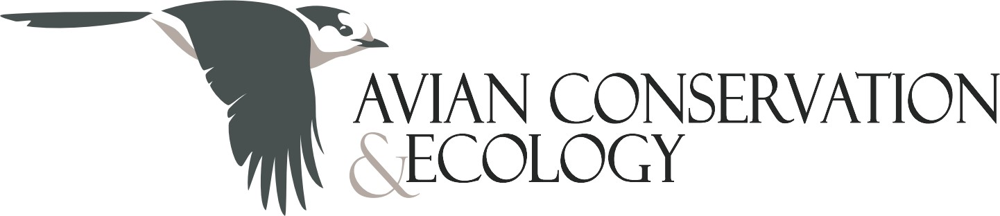

**5 au 7 octobre 2026**

{width=50% fig-align="center" fig-alt=""}

#### Actualités

- [9 avril 2026] **Appel à [ateliers](participate.qmd#workshops) et [présentations pour la vitrine de recherche pancanadienne](participate.qmd#showcase)** - **Date limite: le 31 mai 2026**

Nous sommes ravis d'annoncer que notre conférence de 2026 se déroulera en ligne, ouvrant ainsi ses portes à une communauté de participants vaste et diversifiée provenant du monde entier! Le thème de cette année, Déployer nos ailes, célèbre l’accessibilité, les échanges et la joie de la découverte, de part notre communauté de recherche. Nous avons hâte d’échanger avec nos membres et d’explorer de nouvelles façons d’apprendre et de collaborer ensemble.

Prenez note de ces dates! Les détails concernant la soumission de résumés scientifiques seront communiqués prochainement.

### Sponsors

<!--.column-page and .column-screen-inset, .column-screen > All progressively wider for when we have more -->
::: {.column-page-inset layout-nrow=1 layout-valign="center"}
[{.logo fig-alt="Logo du commanditaire Oiseaux Canada"}](https://www.birdscanada.org/)

[{.logo fig-alt="Logo du commanditaire Zeiss"}](https://www.zeiss.ca/corporate/en/home.html)

[{.logo fig-alt="Logo du commanditaire ACE"}](https://ace-eco.org/)
:::

::: {.column-screen}
{fig-alt=""}
:::