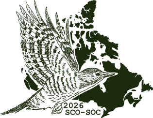
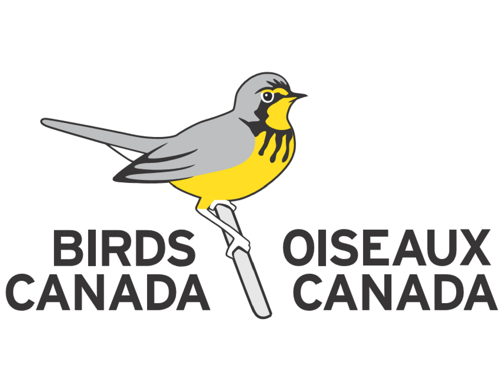
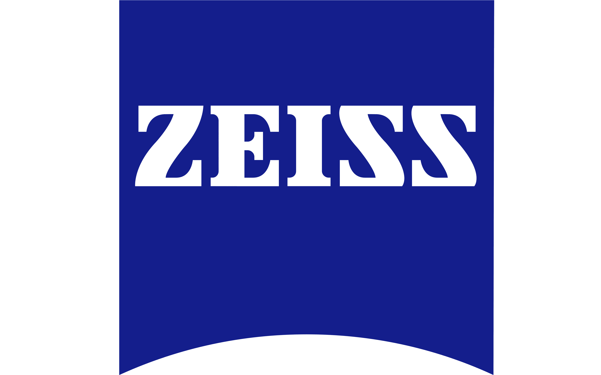
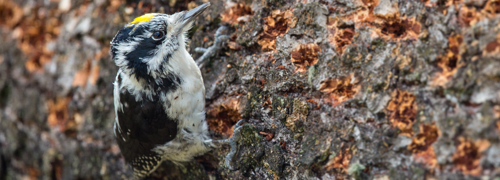

**5 au 7 octobre 2026**

{width=50% fig-align="center" fig-alt="" title="Logo par Sunny Tseng"}

### Venez participer!

**Lundi 5 octobre 2026** -- [Lien Zoom pour l’assemblée générale annuelle](https://birdscanada-org.zoom.us/j/81081535269?pwd=jmPYvNG0PNRrK8Trr4PeOgOD86eVA5.1) (16h30, heure de l’Est)

**Lundi 5 octobre 2026** -- [Lien Zoom pour la rencontre des ornithologues 2SLGBTQIA+](https://birdscanada-org.zoom.us/j/84924337889?pwd=5RLFYqhCbJAd1DGNaa2ipjkFvqnFTm.1 ) (17h30, heure de l’Est)

<!-- 
**Mardi 6 octobre 2026** -- [Lien Zoom pour les présentations des étudiant·e·s](https://birdscanada-org.zoom.us/j/87998208146?pwd=5MhpRW1vHfbpf2KNBkbneIAD6ssub0.1) (voir le [programme](program.qmd#presentations))

**Mercredi 7 octobre 2026** -- [Lien Zoom pour les présentation de la recherche pancanadienne](https://birdscanada-org.zoom.us/j/85872200877?pwd=6pEE79DoIuW68tUUUvn0qJMa7epZ6Z.1) (voir le [programme](program.qmd#showcases)) -->

### T-Shirts!

Si vous souhaitez toujours commander un t-shirt de conférence, vous pouvez le faire en vous rendant directement chez le [fournisseur](https://www.printful.com/ca/product-template/107570868/80426ceced1f1c5f8df9e42dd5d98d12).

### Actualités

::: {.tbl-invisible style="margin-bottom: 20px"}
x | x | x |
:------------ |:----------------------------------------|:---------------------:|
22 sept 2026 | **[Les présentations des étudiant·e·s sont en ligne!](program.qmd#presentations)** | |
12 août 2026 | **[Inscriptions ouvertes!](participate.qmd#inscription)** | Inscriptions anticipées ~~31 août~~ 11 septembre 2026 |
17 juillet 2026 | **[Les présentations de la recherche pancanadienne sont en ligne!](program.qmd#showcases)** | |
23 juin 2026 | **[Les ateliers sont en ligne!](program.qmd#workshops)** | |
25 mai 2026  | **Appel à [résumés](participate.qmd#presentations)** | Terminé |
9 avril 2026 | **Appel à [ateliers](participate.qmd#workshops) et [présentations pour la vitrine de recherche pancanadienne](participate.qmd#showcase)** | Terminé | |

: {tbl-colwidths="[13, 50, 25]"}

:::

Nous sommes ravis d'annoncer que notre conférence de 2026 se déroulera en ligne, ouvrant ainsi ses portes à une communauté de participants vaste et diversifiée provenant du monde entier! Le thème de cette année, Déployer nos ailes, célèbre l’accessibilité, les échanges et la joie de la découverte, de part notre communauté de recherche. Nous avons hâte d’échanger avec nos membres et d’explorer de nouvelles façons d’apprendre et de collaborer ensemble.

Prenez note de ces dates!

*Logo de la réunion virtuel 2026 de la SCO-SOC par [Sunny Tseng](https://sunnytseng.ca/design/).*

### Sponsors

<!--.column-page > .column-screen-inset > .column-screen > All progressively wider for when we have more -->
::: {.column-screen layout-nrow=1 layout-valign="center"}
[{.logo fig-alt="Logo du commanditaire Oiseaux Canada"}](https://www.birdscanada.org/)

[{.logo fig-alt="Logo du commanditaire Zeiss"}](https://www.zeiss.ca/corporate/en/home.html)

[{.logo fig-alt="Logo du commanditaire ACE"}](https://ace-eco.org/)

[{.logo fig-alt="Logo du commanditaire Wildlife Acoustics"}](https://www.wildlifeacoustics.com/)

[{.logo fig-alt="Logo du commanditaire Western Centre for Animals on the Move"}](https://www.uwo.ca/cam/)
:::

::: {.column-screen}
{fig-alt=""}
:::