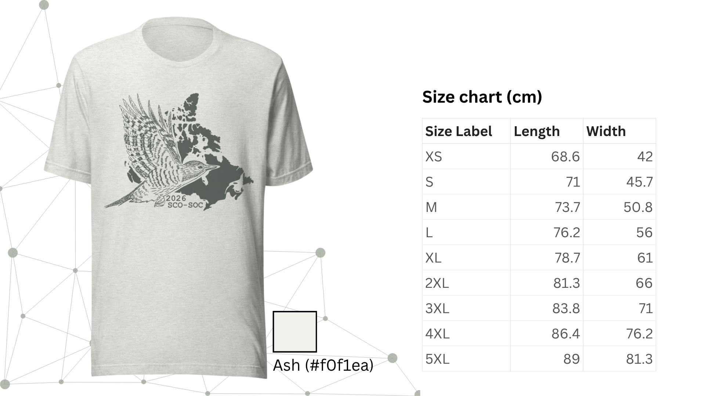

### Tableau des tailles de t-shirts (#tshirt-size)

:::{style="width: 50%; margin:auto;"}
| Taille | Longueur (cm) | Largeur (cm) |
|:---------------------:|:----------:|:---------:|
| TP                  | 68,6     | 42      |
| P                   | 71       | 45,7    |
| M                   | 73,7     | 50,8    |
| G                   | 76,2     | 56      |
| TG                  | 78,7     | 61      |
| 2TG                 | 81,3     | 66      |
| 3TG                 | 83,8     | 71      |
| 4TG                 | 86,4     | 76,2    |
| 5TG                 | 89       | 81,3    |
:::

{fig-alt=""}